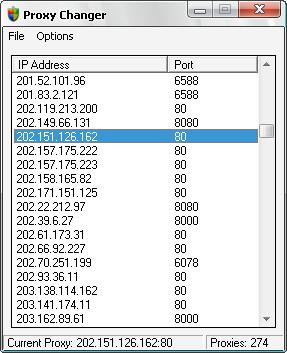



## Set a Proxy Without Having to Restart IE

### Description

Here's a proxy changer that allows you to set or disable a proxy without having to restart IE. All the code I have found so far here on pscode about setting a proxy requires you to restart IE.

The code is converted from the C++ code on http://www.codeproject.com/internet/changeproxy1.asp

I didn't convert it, but I made a few small changes, because there was a flaw in releasing the memory, which made it crash the second time the proxy was set or disabled.

No proxy lists have been included, because free proxies only work for several hours/days. Google is your friend ;)

Only tested on Windows XP.
 
### More Info
 

             |
---                |---
**Submitted On**   |2007-01-26 04:33:40
**By**             |[Chris Donovan](https://github.com/Planet-Source-Code/PSCIndex/blob/master/ByAuthor/chris-donovan.md)
**Level**          |Intermediate
**User Rating**    |5.0 (15 globes from 3 users)
**Compatibility**  |VB 6\.0
**Category**       |[Internet/ HTML](https://github.com/Planet-Source-Code/PSCIndex/blob/master/ByCategory/internet-html__1-34.md)
**World**          |[Visual Basic](https://github.com/Planet-Source-Code/PSCIndex/blob/master/ByWorld/visual-basic.md)
**Archive File**   |[Set\_a\_Prox2045161282007\.zip](https://github.com/Planet-Source-Code/chris-donovan-set-a-proxy-without-having-to-restart-ie__1-67749/archive/master.zip)

